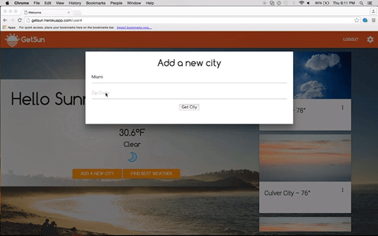
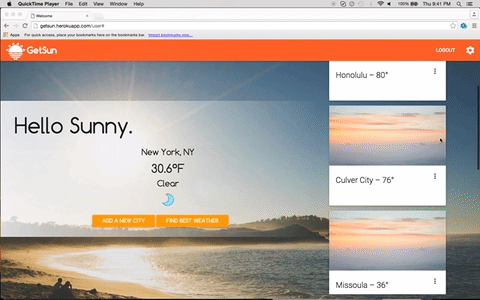

# GetSun
## A web application that connects people with the warm places they want to go to.

#### Approach:
As a team, we wanted to create a web application that helps people who are in need of a little sunshine.  Since weather is one of the major factors that affects our daily experiences we developed a tool that gives that cloudy day a silver lining by providing options of locations either close by or anywhere else that might be sunnier than the user's current location.

With GetSun it becomes much easier for the user to find a sunny destination to restore their sunny disposition.

#### GetSun allows a user to:
* Enter their home location and view current temperature and weather conditions.
* Store 10 of their favorite cities and view current temperature and weather conditions.
* View the 10 favorite cities in order of most optimal temperature and weather conditions in each             city.
* Obtain driving directions between the home location and any location in the continental United States.
* Search to find the most optimal temperature and weather conditions within a radius of their chosen location.

#### Technologies used:
* node.js
* Express
* JavaScript
* JQuery
* MongoDB
* Third Party APIs:
    * Weather Underground
    * Zipcode
    * Google Directions
* Materialize
* Handlebars
* [Deployed on](http://getsun.herokuapp.com/) Heroku.

#### Challenges:
1. Logic of rating a city based on temperature and weather conditions.
1. Understanding the differences between how GET and POST requests are structured.
1. Keeping files organized among multiple people.

