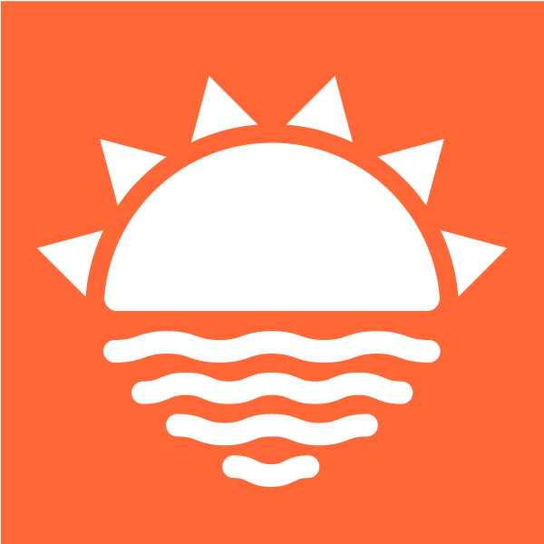

# FunInTheSun
## A web application that connects people with the warm places they want to go to.

### Approach:
As a team, we wanted to create an web application that helps people who are in need of a refreshing getaway or a weekend of fun in the sun.  Since weather is one of the major factors in choosing a travel destination we wanted to develop a tool that takes that uncertainty out of the equation.

### FunInTheSun allows a user to:
* Enter their home location and view current temperature and weather conditions.
* Store 10 of their favorite cities and view current temperature and weather conditions.
* View the 10 favorite cities in order of most optimal temperature and weather conditions in each             city.
* Obtain driving directions between the home location and any location in the continental United States.
* Search to find the most optimal temperature and weather conditions within a radius of their chosen location.

Technologies used:
* Express
* JavaScript
* JQuery
* Mongo
* AJAX
* Third Party API's:
    * Weather Underground
    * Zipcode
    * Google Directions
* Local API
    * User
* Materialize
* Handlebars
* [Deployed on](http://funinthesun.herokuapp.com/) Heroku.

Challenges:
1. Logic of rating a city based on temperature and weather conditions.
1. Understanding the differences between how GET and POST requests are structured.
1. Keeping files organized among multiple people.

<!-- Explanations of the technologies used
Screenshots of the consumer application in action
A couple paragraphs about the general approach you took
Installation instructions for any dependencies
Link to your wireframes – sketches of major views / interfaces in your application
Descriptions of any unsolved problems or major hurdles your team had to overcome -->
